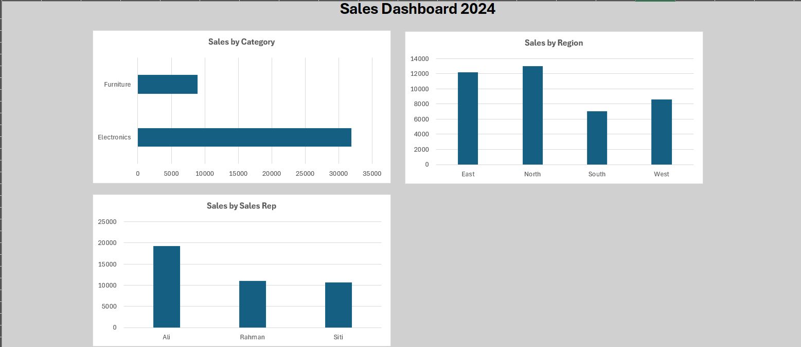

Excel Sales Dashboard 2024
A beginner data analyst portfolio project building an interactive sales dashboard using Microsoft Excel, PivotTables, and charts.
---
About This Project
This project demonstrates the ability to take raw sales data, summarise it using PivotTables, and present key business insights visually through a clean dashboard. It simulates the kind of reporting a junior data analyst or operations analyst would produce for a sales team.
---
Dashboard Preview

---
Key Insights Found
Electronics is the top performing category with RM 31,900 in sales vs Furniture at RM 8,950
North is the highest performing region with RM 13,000 in sales
Ali is the top sales rep with RM 19,200 — nearly double the other reps
Total revenue across all orders: RM 40,850
---
What The Dashboard Shows
Chart	Description
Sales by Category	Compares Electronics vs Furniture total sales
Sales by Region	Compares sales across East, North, South, West
Sales by Sales Rep	Compares individual performance of Ali, Rahman, Siti
---
Excel Skills Demonstrated
Skill	Description
Data entry & formatting	Clean structured table with headers
Formula	`=F2*G2` to calculate Total Sales per order
SUM formula	`=SUM(I2:I11)` for grand total
PivotTable	Summarised data by Category, Region, Sales Rep
PivotChart	Visual bar and column charts from PivotTables
Dashboard design	Clean layout with title, background, no gridlines
---
Files
File	Description
`sales_data.xlsx`	Excel workbook with raw data, PivotTables and Dashboard
`dashboard_screenshot.png`	Screenshot of the completed dashboard
`README.md`	Project documentation
---
Tools Used
Microsoft Excel — data entry, formulas, PivotTables, charts, dashboard
---
About Me
I am a junior IT professional based in Johor, Malaysia, actively transitioning into data analytics. This is the second project in my self-directed portfolio, building practical Excel skills relevant to data analyst and operations analyst roles.
🔗 View my SQL portfolio project: https://github.com/Praveena98-CG/data-center-sql-project
